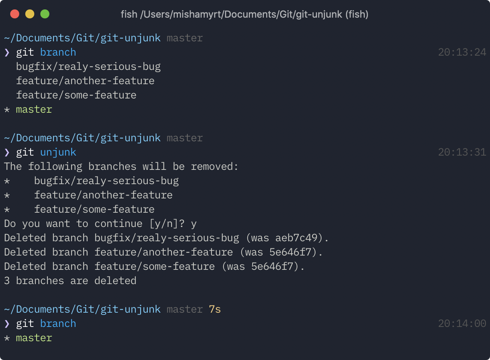

# Git Unjunk

A simple script that removes all the branches from which commits are already merged to the active.

<p align="center">

</p>

## Installation

```sh
git clone git@github.com:mishamyrt/git-unjunk.git
cd git-unjunk
sudo make install
```

## Usage

Navigate to the repository folder and run `git-unjunk` command.